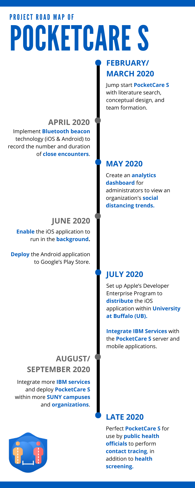

# PocketCare S - Android

<p align="center">

</p>

**Call for Code submission for COVID-19 track.**

PocketCare S is a comprehensive smartphone-based solution for monitoring close encounters. It is a bluetooth low energy (BLE) based solution which enables smartphones to send and receive anonymous beacon signals. It checks the distance between a smartphone and another beacon (or smartphone running PocketCare S) to see if they are close to each other (less than 2m). If so, the smartphone records the duration of such a close encounter with another beacon. 

PocketCare S is designed to report social distance information without collecting or revealing any personally identifiable information about any specific individual.


## Contents 
1. [Demo Video](#demo-video) 
2. [The Architecture](#the-architecture)
3. [Getting Started](#getting-started)
4. [How does PocketCare S Work?](#how-does-pocketcare-s-work)
5. [Built With](#built-with)
6. [Project Road Map](#project-road-map)
7. [Additional Information](#additional-information)
8. [License](#license)
9. [Acknowledgments](#acknowledgements)

## Demo Video 

[](http://www.youtube.com/watch?v=JnOWwagUgxQ "PocketCare S Demo")
 
 
## The Architecture


## Getting Started 

**Due to emulators not supporting bluetooth, close encounter detection will not work on emulators.**

### Prerequisites

Before you begin, make sure you satisfy the following requirements:

1. You are running this on a physical android device.
2. The device should at least be running on [android sdk version 21](https://developer.android.com/studio/releases/platforms#5.0) (Android L).
3. The device should have Bluetooth LE support. More details about this requirement can be found [here](#how-does-pocketcare-s-work). 

As long as you run this on any modern android device, the application should work properly. You can check the Bluetooth LE compatibility of your device [here](https://altbeacon.github.io/android-beacon-library/beacon-transmitter-devices.html). 


### Running PocketCare S using Android Studio

1. Open the project in Android Studio.
2. Wait for Gradle build to finish.
3. Connect your android device to your computer and make sure you have USB debugging turned on. You can follow this [article](https://developer.android.com/studio/debug/dev-options#enable) to enable usb debugging.  
4. The application is already configured with the IBM server URL. If you want to run server on your local machine follow the PocketCareS-Server setup documentation and replace the **serverHost** variable in [ServerHelper](app/build/intermediates/javac/debug/classes/com/ub/pocketcares/network/ServerHelper.class) java file with your URL. 
```java
    private final static String serverHost = "YOUR_SERVER_URL";
```
5. Android Studio should automatically detect the configurations, after the gradle build is finished click on the play button on top to run PocketCare S. If the gradle build does not succeed follow [this document](https://developer.android.com/studio/known-issues) to troubleshoot any errors. 

### Running PocketCare S using an APK 

1. On your android device, make sure you have enabled. You can follow this [article](https://www.androidcentral.com/unknown-sources) to enable it. 
2. Download the APK from here. 
3. After the APK is downloaded, tap to install it and run PocketCare S.

Once the application starts, follow the on-boarding process and read how PocketCare S works below. 

## How does PocketCare S Work?

### Key Highlights (Mobile Application)

1. Close encounter data will be displayed in the mobile application after a close encounter session starts. A close encounter session starts when two people are within **2 meters** for at least **5 minutes**. 
2. The **virtual bluetooth name** changes every hour to ensure **user privacy**. 
3. Data upload to the server takes place every hour.
4. Data is stored in user's phone for a maximum of 14 days. 

### Detailed Architecture 


### Technological Advances

PocketCare S has made significant technological advances compared to other solutions. An Infographic with this information can be found [here](https://engineering.buffalo.edu/content/dam/engineering/computer-science-engineering/images/pocketcare/PocketCareS-TechAdvances.pdf).

### Security and Privacy 

PocketCare S cares values the security and privacy of its users. The app does not collect any private information about an individual person.  All the data collected is anonymous and will not reveal any personally identifiable information. An Infographic with this information can be found [here](https://engineering.buffalo.edu/content/dam/engineering/computer-science-engineering/images/pocketcare/PocketCareS.pdf).


**For a more detailed description, refer to the [additional information](#additional-information) section.**


## Built With 

In this submission, we have used IBM’s Cloud **Red Hat OpenShift** to deploy our server (using **OpenJDK 8**), database (using **MongoDB**), the web portal (using **Node JS Server**) and **IBM Push Notification Service** from **IBM Cloud** in the android application of PocketCare S as a proof of concept. In the future, we will consider integrating other IBM services into the PocketCare S solution.

## Project Road Map 



## Additional Information 

You can read more about PocketCare S on our [website](https://engineering.buffalo.edu/computer-science-engineering/pocketcares.html). We also have a [White Paper](https://docs.google.com/document/d/e/2PACX-1vT6UqA3HByzG5Di576gmz-JWzgKOFx5KLYGgJMpxcmWkOXYJ_vUFz2h1w2LnDNWI4y-xnyKhPi_s70p/pub) which can be accessed here.  

PocketCare S is also available on [Google Play](https://play.google.com/store/apps/details?id=com.ub.pocketcares) and to the University at Buffalo (UB) community using the [Apple Developer Enterprise Program](https://engineering.buffalo.edu/computer-science-engineering/pocketcares/pocketcares-ios.html).

## License 

This project is licensed under the Apache 2 License - see the [LICENSE](LICENSE) file for details.

## Acknowledgements

Special thanks to all who helped bring the project to fruition:

Sourav Samanta, Rishabh Joshi, Jeetendra Gan, Shanelle Ileto, Aritra Paul, Dr. Peter Winkelstein, Dr. Matthew R. Bonner, Kevin Wang, Chen Yuan, Dheeraj Bhatia, Latheeshwarraj Mohanraj, Dr. Wen Dong, Dr. Tong Guan, Dr. Marina Blanton, Sasha Shapiro, Stephen Fung

And our deepest gratitude for the support of University at Buffalo.