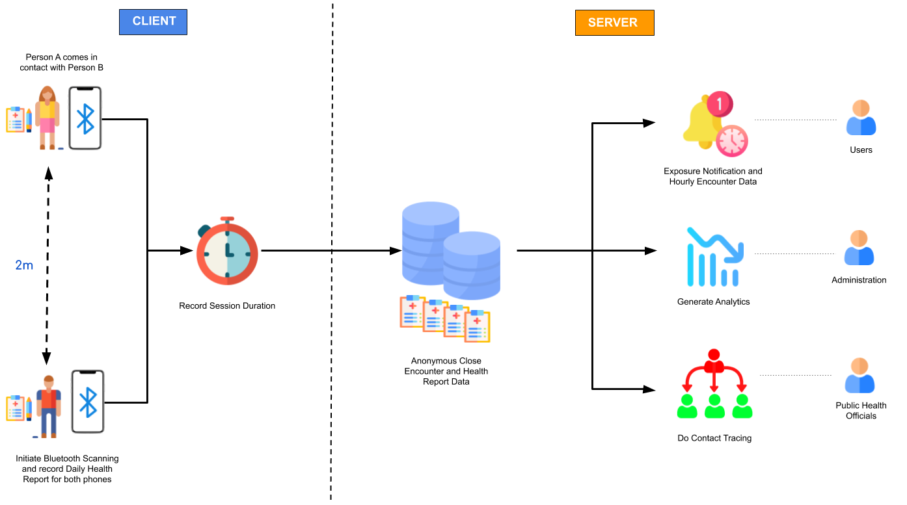
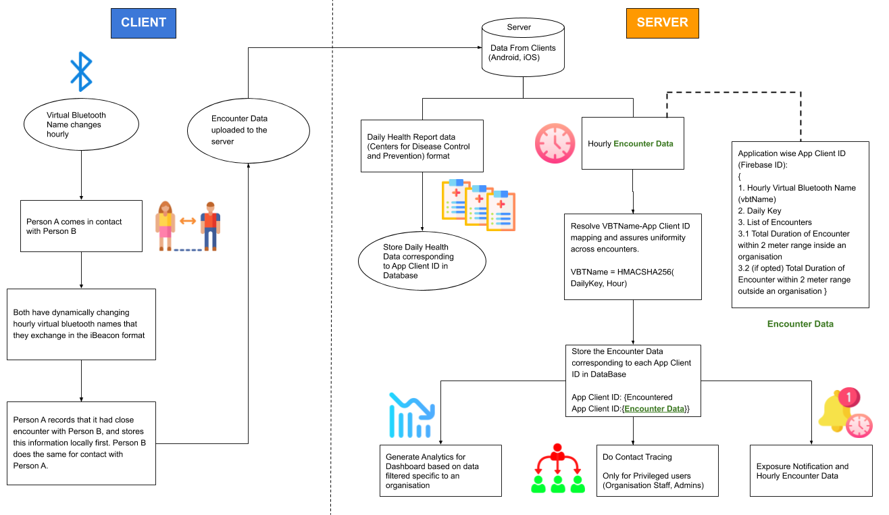

# PocketCare S - Android

<p align="center">

</p>

**Call for Code submission for COVID-19 track.**

PocketCare S is a comprehensive smartphone-based solution for monitoring close encounters. It is a bluetooth low energy (BLE) based solution which enables smartphones to send and receive anonymous beacon signals. It checks the distance between a smartphone and another beacon (or smartphone running PocketCare S) to see if they are close to each other (less than 2m). If so, the smartphone records the duration of such a close encounter with another beacon. 

PocketCare S is designed to report social distance information without collecting or revealing any personally identifiable information about any specific individual.


## Contents 
1. [Demo Video](#demo-video) 
2. [The Architecture](#the-architecture)
3. [Getting Started](#getting-started)
4. [How does PocketCare S Work?](#how-does-pocketcare-s-work)
5. [Push Notification for Exposure]()
6. [Built With](#built-with)
7. [Project Road Map](#project-road-map)
8. [Additional Information](#additional-information)
9. [License](#license)
10. [Acknowledgments](#acknowledgements)    

## Demo Video 

[](https://youtu.be/JUTQIcdgXwc "PocketCare S Demo")
 
 
## The Architecture



## Getting Started 

**Due to emulators not supporting Bluetooth, close encounter detection will not work on emulators.**

### Prerequisites

Before you begin, make sure you satisfy the following requirements:

1. You are running this on a physical Android device.
2. The device should at least be running on [Android SDK Version 21](https://developer.android.com/studio/releases/platforms#5.0) (Android L).
3. The device should have Bluetooth LE support. More details about this requirement can be found [here](#how-does-pocketcare-s-work). 

As long as you run this on any modern Android device, the application should work properly. You can check the Bluetooth LE compatibility of your device [here](https://altbeacon.github.io/android-beacon-library/beacon-transmitter-devices.html). 


### Running PocketCare S using Android Studio

1. Open the project in Android Studio.
2. Wait for Gradle build to finish.
3. Connect your Android device to your computer and make sure you have USB debugging turned on. You can follow this [article](https://developer.android.com/studio/debug/dev-options#enable) to enable usb debugging.  
4. The application is already configured with the IBM server URL. If you want to run server on your local machine follow the PocketCareS-Server setup documentation and replace the **serverHost** variable in [ServerHelper](app/src/main/java/com/ub/pocketcares/network/ServerHelper.java) java file with your URL. 
```java
    private final static String serverHost = "YOUR_SERVER_URL";
```
5. Android Studio should automatically detect the configurations, after the gradle build is finished click on the play button on top to run PocketCare S. If the gradle build does not succeed follow [this document](https://developer.android.com/studio/known-issues) to troubleshoot any errors. 

### Running PocketCare S using an APK 

1. On your Android device, make sure you have enabled. You can follow this [article](https://www.androidcentral.com/unknown-sources) to enable it. 
2. Download the APK from here. 
3. After the APK is downloaded, tap to install it and run PocketCare S.

Once the application starts, follow the on-boarding process and read how PocketCare S works below. 

## How does PocketCare S Work?

Throughout this section, you can learn how PocketCare S works and the factors that differentiates it from other solutions hoping to solve similar problems. 

### Key Highlights (Mobile Application)

1. PocketCare S uses **Bluetooth Low Energy (BLE)** to discover and compute the duration **close encounters**. 
2. A **close encounter** session starts when two people are within **2 meters** for at least **5 minutes**. 
3. **Close encounter** data will be displayed in the mobile application after a close encounter session starts. 
4. Users are **notified immediately** if a close encounter session exceeds **10 minutes**.
5. The **virtual bluetooth name** changes **every hour** to ensure **user privacy**. 
6. Data stored in the mobile application is **anonymized** (contains no Personally Identifiable Information) and consists of **daily health report** and **close encounters** for a **maximum period of 14 days.**
7. Data upload to the server takes place **every hour**.

### Detailed Architecture 



### Technological Advances

PocketCare S has made significant technological advances compared to other solutions. An Infographic with this information can be found [here](https://engineering.buffalo.edu/content/dam/engineering/computer-science-engineering/images/pocketcare/PocketCareS-TechAdvances.pdf).

### Security and Privacy 

PocketCare S cares values the security and privacy of its users. The app does not collect any private information about an individual person.  All the data collected is anonymous and will not reveal any personally identifiable information. An Infographic with this information can be found [here](https://engineering.buffalo.edu/content/dam/engineering/computer-science-engineering/images/pocketcare/PocketCareS.pdf).

**For a more detailed description, refer to the [additional information](#additional-information) section.**

## Push Notifications for Exposure 

PocketCare S plans to implement automatic contact tracing by collaborating with healthcare organizations in the future. In the current Android application, we have added an experimental feature to show how these notifications would work in the future. 

PocketCare S Android application can get push notification for COVID-19 exposure from the web portal. You can learn more about the process [here](). This is still a work in progress and hence you will need to get the unique App Client ID of the infected person from the Android application itself to notify the users who have been in contact with the infected person. You can get the App Client ID following the guide below. 

### Getting App Client ID 

Follow these directions for **Android Studio** or **ADB** to get the App Client ID. 

#### Using Android Studio

1. Open the PocketCare S Android project in Android Studio. 
2. Connect the android device to your computer with the application run. If it is not running, click on the play button and run the application. 
3. In the bottom of the screen, click on log cat and in the search box paste *App_Client_ID*. This is the tag used to filter the ADB log and get the logged value of App Client.
4. Copy this value of App Client ID and proceed with the exposure notification [documentation](). 

#### Using ADB

1. Make sure you have ADB installed in your system. Follow this [guide](https://www.xda-developers.com/install-adb-windows-macos-linux/) to install ADB in your system.
2. Connect your phone to the computer (make sure USB debugging is turned on and the application is running) and open your favorite terminal. 
3. Type ***adb devices*** and make sure your phone is in the "List of attached devices".
4. Now to get the value of App Client ID from the logcat type ***adb logcat -s App_Client_ID***.
5. Copy this value of App Client ID and proceed with the exposure notification [documentation](). 


## Built With

- [Android Beacon Library](https://altbeacon.github.io/android-beacon-library/) - Used for close contact detection in Android
- [IBM Push Notifications](https://www.ibm.com/cloud/push-notifications) - Push Notification for Exposure 
- [High Charts](https://www.highcharts.com/) - Used to visualize data
- [Red Hat OpenShift on IBM Cloud](https://www.ibm.com/cloud/openshift)
  - Server using [OpenJDK 8](https://www.ibm.com/cloud/support-for-runtimes)
  - Database using [MongoDB](https://www.ibm.com/cloud/databases-for-mongodb)
  - Web Portal hosted using [Node JS Server](https://developer.ibm.com/node/cloud/)
- [React](https://reactjs.org/) - Used to build the web portal 
- [Spring Boot](https://spring.io/projects/spring-boot) - Framework for the Server

## Project Road Map 


## Additional Information 

You can read more about PocketCare S on our [website](https://engineering.buffalo.edu/computer-science-engineering/pocketcares.html). We also have a [White Paper](https://docs.google.com/document/d/e/2PACX-1vT6UqA3HByzG5Di576gmz-JWzgKOFx5KLYGgJMpxcmWkOXYJ_vUFz2h1w2LnDNWI4y-xnyKhPi_s70p/pub) which can be accessed here. 

An in-depth video on the PocketCare S mobile application can be found [here](https://youtu.be/qvDil5-OTio).

PocketCare S is also available on [Google Play](https://play.google.com/store/apps/details?id=com.ub.pocketcares) and to the University at Buffalo (UB) community using the [Apple Developer Enterprise Program](https://engineering.buffalo.edu/computer-science-engineering/pocketcares/pocketcares-ios.html).

## License 

This project is licensed under the Apache 2 License - see the [LICENSE](LICENSE) file for details.

## Acknowledgements

Special thanks to all who helped bring the project to fruition:

Sourav Samanta, Rishabh Joshi, Jeetendra Gan, Shanelle Ileto, Aritra Paul, Dr. Peter Winkelstein, Dr. Matthew R. Bonner, Kevin Wang, Chen Yuan, Dheeraj Bhatia, Latheeshwarraj Mohanraj, Dr. Wen Dong, Dr. Tong Guan, Dr. Marina Blanton, Sasha Shapiro, Stephen Fung, David G. Young

And our deepest gratitude for the support of **University at Buffalo**.